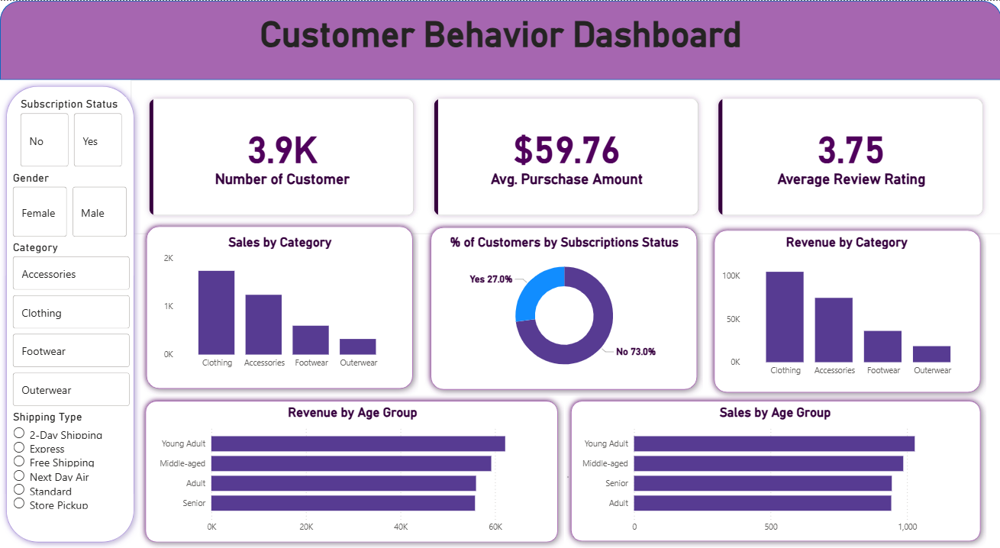

# Customer Behavior Analysis

End-to-end data analysis project using Python, SQL, and Power BI.

This project analyzes customer shopping behavior based on a retail dataset with 3,900 transactions.  
The goal is to understand how customers buy, what drives revenue, and how factors like discounts and subscriptions affect spending.


## 📌 Project Goals

- Identify high-value customer segments  
- Analyze revenue and sales by product category  
- Evaluate the impact of discounts and subscriptions  
- Explore customer behavior across age groups  
- Build a business-oriented dashboard for decision support  


## 🛠 Tech Stack

- **Python (Pandas, NumPy)** — data cleaning, preprocessing, basic feature engineering  
- **PostgreSQL / SQL** — analytical queries, aggregations, CTEs  
- **Power BI** — interactive dashboard and KPI visualization  
- **Git** — version control and project structure  


## 📂 Repository Structure

```text
customer-behavior-analysis/
├── data/
│   └── customer_data.csv
├── python/
│   └── eda_and_cleaning.ipynb
├── sql/
│   └── queries.sql
├── powerbi/
│   └── dashboard.pbix
├── docs/
│   ├── 01_business_problem.pdf
│   ├── 02_analysis_report.pdf
│   └── 03_presentation.pdf
├── README.md
└── .gitignore
```

## 🔍 Key Analysis Areas

- Revenue by gender and product category  
- Customers who used discounts but spent above average  
- Subscription impact on average order value  
- Top products by average review rating  
- Customer segmentation (New / Returning / Loyal)  
- Revenue contribution by age group  


## 📊 Dashboard

Below is a preview of the interactive Power BI dashboard built for this project:



An interactive Power BI dashboard was built to visualize:

- KPIs:  
  - Number of Customers  
  - Average Purchase Amount  
  - Average Review Rating  
  - Subscription Rate  
- Revenue by category  
- Revenue by age group  
- Customer distribution by subscription status  


## 📈 Business Insights (Examples)

- Subscribers spend more on average per order than non-subscribers  
- Clothing and Accessories generate the highest revenue  
- Young Adults are the top revenue-generating age group  
- Discounts help increase order value but should be targeted carefully  


## 📄 Project Documentation

- [Business Problem Statement](docs/01_business_problem.pdf)  
- [Analysis Report](docs/02_analysis_report.pdf)  
- [Presentation](docs/03_presentation.pdf)  

 
